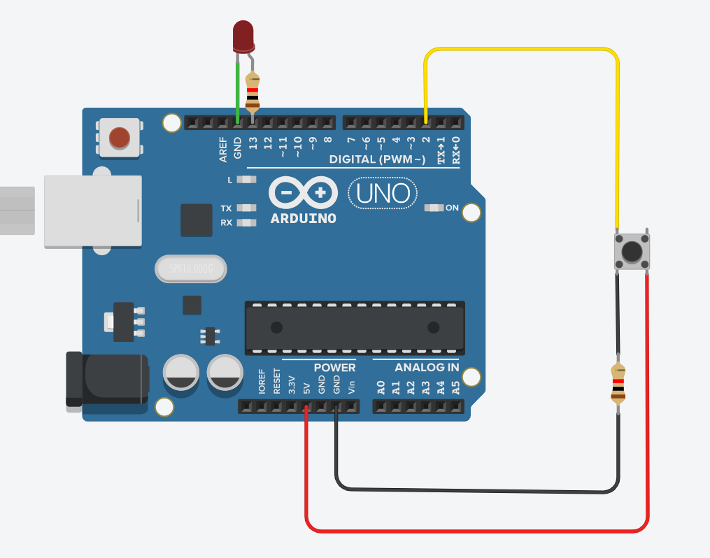

# Pratica-7
LED controlada por switch utilizando interrupção.

---

O seguinte esquema de hardware utilizando arduino UNO é esperado:

---

O código de controle da LED em linguagem C encontra-se no arquivo interrupt.c deste repositório.